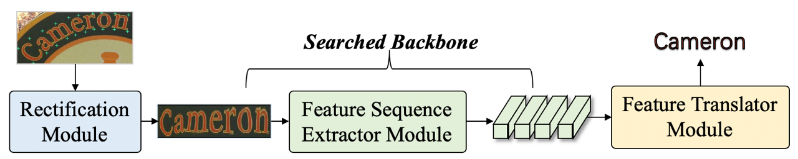

# AutoSTR: Efficient Backbone Search for  Scene Text Recognition

We investigate how to obtain a strong feature sequence extractor for scene text recognition task by neural architecture search technology. The research paper can be found [here](https://arxiv.org/pdf/2003.06567.pdf) ECCV. 2020.




## Requirements

```
python==3.6.7
pytorch==1.4.0
torchvision==0.2.1
lmdb
PyYAML
pillow
editdistance
...
```

## Searching Network Architecture

```
python3 arch_search_exp.py --config_file configs/search.yaml 
```

## Retraining Compact Structure

```
python3 main.py --config_file configs/retrain.yaml 
```

## logs and checkpoints 

The logs and checkpoints can be found in [here](https://pan.baidu.com/s/14D4XQWrjbn6R1zmf_7IExw) with extraction code `wp8w`.

## Citation

If you find this work helpful for your research, please cite the following paper:

```
@inproceedings{zhang2020efficient,
  title={AutoSTR: Efficient Backbone Search for Scene Text Recognition},
  author={Zhang, Hui and Yao, Quanming and Yang, Mingkun and Xu, Yongchao and Bai, Xiang},
  booktitle={Proceedings of the European Conference on Computer Vision (ECCV)},
  year={2020}
}
```
```
@TechReport{yao2018taking,
  author      = {Yao, Quanming and Wang, Mengshuo},
  institution = {arXiv preprint},
  title       = {Taking Human out of Learning Applications: A Survey on Automated Machine Learning},
  year        = {2018},
}
```

## Acknowledgement

We used the code part from aster.pytorch (https://github.com/ayumiymk/aster.pytorch) and proxylessnas(https://github.com/mit-han-lab/proxylessnas). Thanks for their excellent work very much.

## New Opportunities
- Interns, research assistants, and researcher positions are available. See [requirement](http://www.cse.ust.hk/~qyaoaa/pages/job-ad.pdf)
